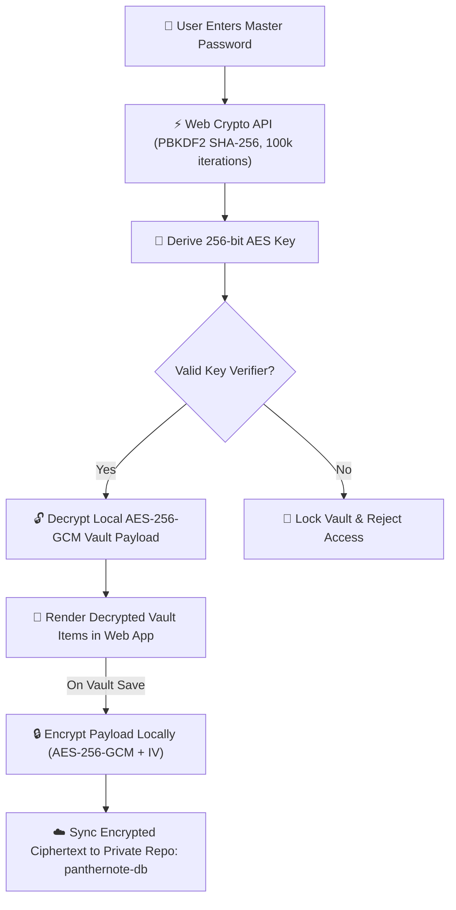

<div align="center">

  <!-- Animated Typing SVG Header Banner -->
  <a href="https://sachinmandawi.github.io/panthernote/">
    
  </a>

  <p align="center">
    <strong>🔒 Your digital life, locked, local, and zero-knowledge encrypted.</strong>
  </p>

  <p align="center">
    <a href="https://sachinmandawi.github.io/panthernote/"></a>
    <a href="https://github.com/sachinmandawi/panthernote/stargazers"></a>
    <a href="https://github.com/sachinmandawi/panthernote/network/members"></a>
    <a href="https://github.com/sachinmandawi/panthernote/blob/main/LICENSE"></a>
  </p>

  <p align="center">
    <a href="#-key-features"><strong>Features</strong></a> •
    <a href="#-security-architecture"><strong>Security Architecture</strong></a> •
    <a href="#-tech-stack"><strong>Tech Stack</strong></a> •
    <a href="#-getting-started"><strong>Getting Started</strong></a> •
    <a href="#-license"><strong>License</strong></a>
  </p>

</div>

---

> [!IMPORTANT]
> 🛡️ **Zero-Knowledge Guarantee**: Your Master Password and unencrypted vault items **NEVER** leave your browser. All encryption and decryption operations occur purely on your local device using native **Web Crypto API (AES-256-GCM)**.

---

## ✨ Key Features

<table>
  <tr>
    <td width="50%">
      <h3>🔐 Zero-Knowledge Security</h3>
      <p>Uses military-grade <strong>AES-256-GCM</strong> encryption with <strong>PBKDF2 SHA-256</strong> key derivation (100,000 iterations). Raw master keys are never stored anywhere.</p>
    </td>
    <td width="50%">
      <h3>☁️ Private GitHub DB Sync</h3>
      <p>Synchronizes encrypted vault data seamlessly to your private GitHub repository (<code>panthernote-db/vault.json</code>). GitHub only ever receives scrambled ciphertext.</p>
    </td>
  </tr>
  <tr>
    <td width="50%">
      <h3>🔑 2FA Authenticator Engine</h3>
      <p>Built-in live TOTP generator with 30-second countdown ring timers. Calculate 6-digit 2FA codes for all your accounts directly inside PantherNote.</p>
    </td>
    <td width="50%">
      <h3>🛡️ Security & Health Audit</h3>
      <p>Proactive security scanner detects weak, reused, or stale (90+ day old) passwords. Integrated breach detection checks with zero plaintext exposure.</p>
    </td>
  </tr>
  <tr>
    <td width="50%">
      <h3>🎨 Smart Brand Auto-Detection</h3>
      <p>Smart icon auto-detection for 100+ popular services, credit cards, and banks (Google, GitHub, Supabase, HDFC, SBI, PayPal) with custom brand palettes.</p>
    </td>
    <td width="50%">
      <h3>⚡ Smart 1-Tap Copy & Selection</h3>
      <p>Instant 1-tap copy for usernames, passwords, card numbers, and CVV codes with sleek haptic toast notifications and zero text selection handles.</p>
    </td>
  </tr>
</table>

---

## 🛡️ Security Architecture



---

## 💻 Tech Stack

<div align="center">

| Layer | Technology | Details |
| :--- | :--- | :--- |
| **Frontend Core** | `HTML5` / `Vanilla JavaScript (ES2024)` | Ultra-fast SPA with zero heavyweight framework overhead |
| **Styling Engine** | `Vanilla CSS3` | Dark Glassmorphic Design System with dynamic fluid micro-animations |
| **Cryptography** | `Web Crypto API (SubtleCrypto)` | Native browser-based `AES-256-GCM` & `PBKDF2 SHA-256` |
| **Cloud Gatekeeper** | `Cloudflare Worker / Gatekeeper` | OAuth 2.0 PKCE authentication flow & zero-knowledge API proxy |
| **Vault Storage** | `GitHub REST API v3` | Encrypted JSON sync in user's private `panthernote-db` repository |
| **Icon System** | `FontAwesome 6 Free` | High-definition scalable vector UI icons |

</div>

---

## 🚀 Getting Started

```bash
# 1. Clone the repository
git clone https://github.com/sachinmandawi/panthernote.git
cd panthernote

# 2. Serve locally
python -m http.server 8000
```

---

## 🔒 Privacy & Open Source Guarantee

- **Zero Telemetry**: PantherNote does NOT track user actions, record analytics, or log IP addresses.
- **Client-Side Encryption**: Your master password never leaves your browser device.
- **100% Auditability**: All source code is completely open-source for full transparency.

---

## 📜 License

Distributed under the **MIT License**. See [`LICENSE`](LICENSE) for more details.

<div align="center">
  <br />
  <sub>Crafted with ❤️ for total privacy & security. Powered by PantherNote.</sub>
</div>
