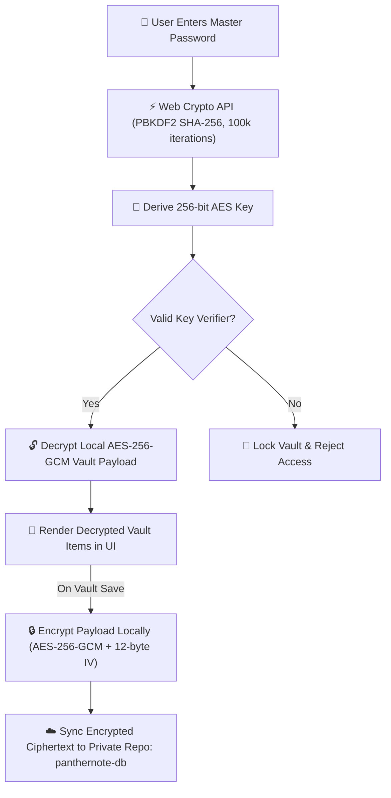

<div align="center">

  <!-- Animated Typing SVG Header Banner -->
  <a href="https://sachinmandawi.github.io/panthernote/">
    
  </a>

  <p align="center">
    <strong>🔒 Your digital life, locked, local, and zero-knowledge encrypted.</strong>
  </p>

  <p align="center">
    <a href="https://sachinmandawi.github.io/panthernote/"></a>
    <a href="https://github.com/sachinmandawi/panthernote/releases/download/v1.0.0/PantherNote-Setup-1.0.0.exe"></a>
    <a href="https://github.com/sachinmandawi/panthernote/releases/download/v1.0.0/PantherNote-Portable.exe"></a>
  </p>

  <p align="center">
    <a href="https://github.com/sachinmandawi/panthernote/releases/latest"></a>
    <a href="https://github.com/sachinmandawi/panthernote/stargazers"></a>
    <a href="https://github.com/sachinmandawi/panthernote/blob/main/LICENSE"></a>
  </p>

  <p align="center">
    <a href="#-about-panthernote"><strong>About</strong></a> •
    <a href="#-application-screenshots--ui-showcase"><strong>Screenshots</strong></a> •
    <a href="#-key-features"><strong>Features</strong></a> •
    <a href="#-security-architecture"><strong>Security Specs</strong></a> •
    <a href="#-tech-stack"><strong>Tech Stack</strong></a> •
    <a href="#-license"><strong>License</strong></a>
  </p>

</div>

---

> [!IMPORTANT]
> 🛡️ **Zero-Knowledge Guarantee**: Your Master Password and unencrypted vault items **NEVER** leave your browser or computer. All cryptographic encryption and decryption operations occur purely on your local device using the browser's native **Web Crypto API (SubtleCrypto)**.

---

## 📖 About PantherNote

**PantherNote** is a privacy-first, zero-knowledge digital vault and password manager crafted for individuals who value total ownership of their sensitive data.

Traditional cloud password managers store user vaults on proprietary servers that can be targeted by centralized breaches. **PantherNote eliminates the middleman entirely:**

- **Zero Centralized Servers**: Your encrypted ciphertext syncs directly to your own private GitHub repository (<code>panthernote-db</code>). Nobody—not even GitHub—can read your data without your master password.
- **True Zero-Knowledge**: Your master password never leaves your browser memory. Encryption keys are derived client-side via **PBKDF2 SHA-256** with **100,000 iterations**.
- **All-in-One Identity Vault**: Seamlessly manage **Logins**, **Debit & Credit Cards (with interactive 3D flip preview)**, **Bank Accounts**, **Secure Notes**, **Custom Categories**, and **Live 2FA TOTP Authenticator Codes**.

---

## 📸 Application Screenshots & UI Showcase

<div align="center">

### 1️⃣ Main Vault & Credentials Overview


<br />

### 2️⃣ 3D Interactive Debit & Credit Cards


<br />

### 3️⃣ Built-in Live 2FA TOTP Authenticator


<br />

### 4️⃣ Smart Password & Passphrase Generator


<br />

### 5️⃣ Security & Health Audit Scanner


<br />

### 6️⃣ Settings, Encryption Keys & Backup Options


<br />

### 7️⃣ Zero-Knowledge Master Password Unlock Screen


<br />

### 8️⃣ Add New Vault Item Modal (Logins, Cards, Banks, Notes)


</div>

---

## ✨ Key Features

<table>
  <tr>
    <td width="50%">
      <h3>🔐 Zero-Knowledge Cryptography</h3>
      <p>Military-grade <strong>AES-256-GCM</strong> encryption with <strong>PBKDF2 SHA-256</strong> (100,000 iterations). Your raw master key is never transmitted or saved anywhere.</p>
    </td>
    <td width="50%">
      <h3>☁️ Private GitHub DB Sync</h3>
      <p>Synchronizes encrypted vault data directly to your private GitHub repository (<code>panthernote-db/vault.json</code>). GitHub only ever receives scrambled ciphertext.</p>
    </td>
  </tr>
  <tr>
    <td width="50%">
      <h3>🔑 Built-in 2FA Authenticator</h3>
      <p>Integrated live TOTP generator with 30-second countdown ring timers. Calculate RFC 6238 6-digit 2FA codes for all your accounts directly inside PantherNote.</p>
    </td>
    <td width="50%">
      <h3>🛡️ Security & Health Audit</h3>
      <p>Proactive security scanner detects weak, reused, or stale (90+ day old) passwords with instant health score feedback and zero plaintext leakage.</p>
    </td>
  </tr>
  <tr>
    <td width="50%">
      <h3>🎨 Smart Brand Auto-Detection</h3>
      <p>Instant brand recognition for 100+ popular services, credit cards, and banks (Google, GitHub, Supabase, HDFC, SBI, PayPal) with custom brand palettes.</p>
    </td>
    <td width="50%">
      <h3>⚡ Smart 1-Tap Copy & Bulk Tools</h3>
      <p>Instant 1-tap copy for usernames, passwords, card numbers, and CVV codes with haptic toast notifications and zero text selection handles.</p>
    </td>
  </tr>
</table>

---

## 🛡️ Security Architecture



### 🔒 Cryptographic Specifications:
| Parameter | Specification | Purpose |
| :--- | :--- | :--- |
| **Cipher Algorithm** | `AES-256-GCM` | Authenticated symmetric encryption for vault records |
| **Key Derivation Function** | `PBKDF2 SHA-256` | Derives 256-bit key from Master Password |
| **Iteration Count** | `100,000 rounds` | Defense against brute-force & dictionary attacks |
| **Initialization Vector (IV)** | `12-byte CSPRNG` | Unique random IV per encryption payload |
| **Security Layer** | `Web Crypto SubtleCrypto` | Native hardware-accelerated browser cryptography |

---

## 💻 Tech Stack

<div align="center">

| Layer | Technology | Details |
| :--- | :--- | :--- |
| **Frontend Core** | `HTML5` / `Vanilla JavaScript (ES2024)` | High-performance SPA with zero heavyweight framework overhead |
| **Styling Engine** | `Vanilla CSS3` | Dark Glassmorphic Design System with fluid dynamic micro-animations |
| **Cryptography** | `Web Crypto API (SubtleCrypto)` | Native browser-based `AES-256-GCM` & `PBKDF2 SHA-256` |
| **Cloud Gatekeeper** | `Cloudflare Worker / Gatekeeper` | OAuth 2.0 PKCE authentication flow & zero-knowledge API proxy |
| **Vault Storage** | `GitHub REST API v3` | Encrypted JSON sync in user's private `panthernote-db` repository |
| **Icon System** | `FontAwesome 6 Free` | High-definition scalable vector UI icons |

</div>

---

## 🚀 Quick Start

### 1. Clone the repository
```bash
git clone https://github.com/sachinmandawi/panthernote.git
cd panthernote
```

### 📱 Desktop App
A standalone Windows desktop application (`PantherNote.exe`) is available locally under `d:\panthernote-desktop-app\dist\`.

---

## 🔒 Privacy & Open Source Guarantee

- **Zero Telemetry**: PantherNote does NOT track user actions, record analytics, or log IP addresses.
- **Client-Side Encryption**: Your master password never leaves your browser device.
- **100% Auditability**: All source code is completely open-source for full transparency.

---

## 📜 License

Distributed under the **MIT License**. See [`LICENSE`](LICENSE) for more details.

<div align="center">
  <br />
  <sub>Crafted with ❤️ for total privacy & security. Powered by PantherNote.</sub>
</div>
