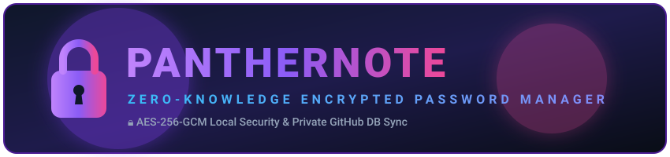
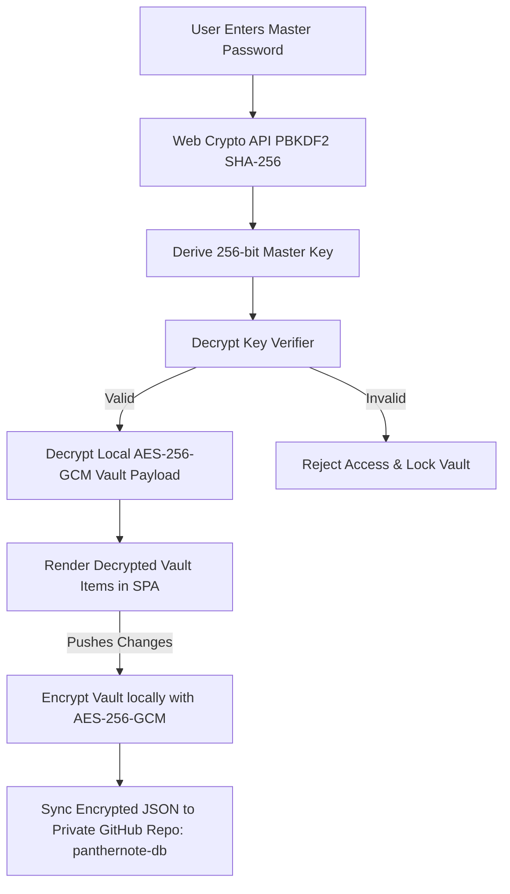

<div align="center">

  <!-- Native SVG Header Banner -->
  <p align="center">
    
  </p>

  <p align="center">
    <strong>Your digital life, locked and local.</strong>
  </p>

  <p align="center">
    <a href="https://github.com/sachinmandawi/panthernote/stargazers"></a>
    <a href="https://github.com/sachinmandawi/panthernote/network/members"></a>
    <a href="https://github.com/sachinmandawi/panthernote/blob/main/LICENSE"></a>
    <a href="https://ciphervault.pages.dev"></a>
  </p>

  <p align="center">
    <a href="#-key-features">Features</a> •
    <a href="#-security-architecture">Security Specs</a> •
    <a href="#-tech-stack">Tech Stack</a> •
    <a href="#-getting-started">Getting Started</a> •
    <a href="#-license">License</a>
  </p>
</div>

---

> [!IMPORTANT]
> **Zero-Knowledge Guarantee**: Your Master Password and unencrypted vault items **NEVER** leave your browser. All encryption and decryption operations occur purely on your local device using the browser's native **Web Crypto API**.

---

## 🌟 Key Features

<table>
  <tr>
    <td width="50%">
      <h3>🔐 Zero-Knowledge Security</h3>
      <p>Uses military-grade <strong>AES-256-GCM</strong> encryption with <strong>PBKDF2 SHA-256</strong> key derivation (100,000 iterations). Your raw master key is never stored anywhere.</p>
    </td>
    <td width="50%">
      <h3>☁️ Private GitHub DB Sync</h3>
      <p>Synchronizes encrypted vault data seamlessly to your private GitHub repository (<code>panthernote-db</code>). GitHub only ever sees scrambled ciphertext.</p>
    </td>
  </tr>
  <tr>
    <td width="50%">
      <h3>🔑 2FA Authenticator Engine</h3>
      <p>Built-in live TOTP generator with 30-second countdown rings. Calculate 6-digit 2FA codes for all your accounts directly inside PantherNote.</p>
    </td>
    <td width="50%">
      <h3>🛡️ Security & Health Audit</h3>
      <p>Proactive security scanner detects weak, reused, or stale (90+ day old) passwords. Includes HaveIBeenPwned API integration for breach checks.</p>
    </td>
  </tr>
  <tr>
    <td width="50%">
      <h3>🎨 Vibrant Brand & Icon Engine</h3>
      <p>Smart icon auto-detection for 100+ popular services, banks, and brands (Google, GitHub, Render, Supabase, SBI, HDFC, etc.) with custom color palettes.</p>
    </td>
    <td width="50%">
      <h3>⚡ Smart Multi-Selection & Bulk Actions</h3>
      <p>Hover card selection mode. Select multiple vault items to bulk pin, move to categories, archive, or trash with 1-click batch actions.</p>
    </td>
  </tr>
</table>

---

## 🛡️ Security Architecture



---

## 💻 Tech Stack

<div align="center">

| Component | Technology | Description |
| :--- | :--- | :--- |
| **Frontend Core** | `HTML5` / `Vanilla JavaScript (ES2024)` | High-performance single page application without heavy frameworks |
| **Styling System** | `Vanilla CSS3` | Custom Dark Glassmorphism Design System with fluid dynamic micro-animations |
| **Cryptography** | `Web Crypto API (SubtleCrypto)` | Native AES-256-GCM encryption & PBKDF2 SHA-256 key derivation |
| **Edge Functions** | `Cloudflare Pages Functions` | OAuth 2.0 authentication flow & zero-knowledge API endpoints |
| **Database Sync** | `GitHub REST API v3` | Private repository synchronization (`panthernote-db/vault.json`) |
| **Iconography** | `FontAwesome 6 Free` | Clean scalable vector UI icons |

</div>

---

## 🚀 Getting Started

### Prerequisites
- Modern web browser supporting Web Crypto API (Chrome, Firefox, Edge, Safari).
- GitHub Account (for private vault cloud synchronization).

### Local Development Setup

1. **Clone the repository**:
   ```bash
   git clone https://github.com/sachinmandawi/panthernote.git
   cd panthernote
   ```

2. **Serve locally**:
   You can serve the static files using any local HTTP server (e.g. Python, Node `http-server`, VS Code Live Server):
   ```bash
   # Using Python 3
   python -m http.server 8000
   ```

3. **Open in Browser**:
   Navigate to `http://localhost:8000` to launch PantherNote locally.

---

## 🔒 Security & Privacy Statement

- **No Remote Telemetry**: PantherNote does NOT track user actions or log IP addresses.
- **Zero-Knowledge**: Your master password is never transmitted over any network.
- **Open Source Auditability**: All code is 100% open-source for full transparency.

---

## 📜 License

Distributed under the **MIT License**. See `LICENSE` for more information.

<div align="center">
  <br />
  <sub>Built with ❤️ for privacy and security. Powered by PantherNote.</sub>
</div>
