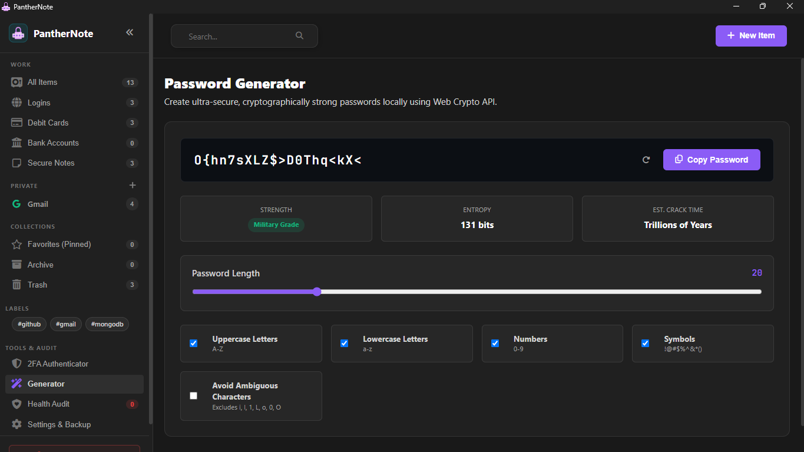

<div align="center">

  <!-- Animated Typing SVG Header Banner -->
  <a href="https://sachinmandawi.github.io/panthernote/">
    
  </a>

  <p align="center">
    <strong>🔒 Your digital life, locked, local, and seamlessly organized.</strong>
  </p>

  <p align="center">
    <a href="https://sachinmandawi.github.io/panthernote/"></a>
    <a href="https://github.com/sachinmandawi/panthernote/releases/download/v1.0.0/PantherNote-Setup-1.0.0.exe"></a>
    <a href="https://github.com/sachinmandawi/panthernote/releases/download/v1.0.0/PantherNote-Portable.exe"></a>
  </p>

  <p align="center">
    <a href="https://github.com/sachinmandawi/panthernote/releases/latest"></a>
    <a href="https://github.com/sachinmandawi/panthernote/stargazers"></a>
    <a href="https://github.com/sachinmandawi/panthernote/blob/main/LICENSE"></a>
  </p>

  <p align="center">
    <a href="#-about-panthernote"><strong>About</strong></a> •
    <a href="#-application-screenshots--ui-showcase"><strong>Screenshots</strong></a> •
    <a href="#-key-features"><strong>Features</strong></a> •
    <a href="#-tech-stack"><strong>Tech Stack</strong></a> •
    <a href="#-license"><strong>License</strong></a>
  </p>

</div>

---

> [!IMPORTANT]
> 🛡️ **Local-First Privacy Guarantee**: All passwords, cards, and notes are stored strictly on your local device by default. Cloud sync is 100% optional via your private GitHub repository (<code>panthernote-db</code>).

---

## 📖 About PantherNote

**PantherNote** is a modern, privacy-first, local digital vault and password manager crafted for individuals who value speed, simplicity, and total ownership of their data.

- **⚡ Instant 0-Second Startup**: Launches directly into your Dashboard with zero login barriers.
- **💾 Local-First Persistence**: Everything is saved automatically and securely in your device's local database.
- **☁️ Optional GitHub Cloud Sync**: Connect anytime from Settings by pasting your GitHub Personal Access Token (PAT) for encrypted cloud backup in your private `panthernote-db` repository.
- **🔑 Built-in 2FA Authenticator**: Calculate RFC 6238 6-digit TOTP codes with 30-second live countdown ring timers.
- **3D Interactive Debit Cards**: Realistic card preview with interactive 3D flip.

---

## 📸 Application Screenshots & UI Showcase

<div align="center">

### 1️⃣ Main Vault & Credentials Overview


<br />

### 2️⃣ 3D Interactive Debit & Credit Cards


<br />

### 3️⃣ Built-in Live 2FA TOTP Authenticator


<br />

### 4️⃣ Smart Password & Passphrase Generator


<br />

### 5️⃣ Security & Health Audit Scanner


<br />

### 6️⃣ Settings, Encryption Keys & Backup Options


<br />

### 7️⃣ Add New Vault Item Modal (Logins, Cards, Banks, Notes)


</div>

---

## ✨ Key Features

<table>
  <tr>
    <td width="50%">
      <h3>💾 Local-First Architecture</h3>
      <p>Instant startup and lightning-fast performance. All vault records are saved directly on your local device.</p>
    </td>
    <td width="50%">
      <h3>☁️ Optional GitHub Cloud Sync</h3>
      <p>Synchronize vault data directly to your private GitHub repository (<code>panthernote-db</code>) simply by entering your Token in Settings.</p>
    </td>
  </tr>
  <tr>
    <td width="50%">
      <h3>🔑 Built-in 2FA Authenticator</h3>
      <p>Integrated live TOTP generator with 30-second countdown ring timers. Calculate RFC 6238 6-digit 2FA codes for all your accounts.</p>
    </td>
    <td width="50%">
      <h3>🛡️ Security & Health Audit</h3>
      <p>Proactive security scanner detects weak, reused, or stale (90+ day old) passwords with instant health score feedback.</p>
    </td>
  </tr>
  <tr>
    <td width="50%">
      <h3>🎨 Smart Brand Auto-Detection</h3>
      <p>Instant brand recognition for 100+ popular services, credit cards, and banks (Google, GitHub, Supabase, HDFC, SBI, PayPal).</p>
    </td>
    <td width="50%">
      <h3>⚡ Smart 1-Tap Copy & Bulk Tools</h3>
      <p>Instant 1-tap copy for usernames, passwords, card numbers, and CVV codes with haptic toast notifications.</p>
    </td>
  </tr>
</table>

---

## 💻 Tech Stack

<div align="center">

| Layer | Technology | Details |
| :--- | :--- | :--- |
| **Frontend Core** | `HTML5` / `Vanilla JavaScript (ES2024)` | High-performance SPA with zero framework overhead |
| **Styling Engine** | `Vanilla CSS3` | Dark Glassmorphic Design System with fluid micro-animations |
| **Cryptography & 2FA** | `Web Crypto API (SubtleCrypto)` | Client-side `HMAC-SHA1` RFC 6238 TOTP Engine |
| **Desktop App** | `Electron` & `electron-builder` | Standalone Windows Installer & Portable Executable |
| **Vault Storage** | `Local Storage` & `GitHub REST API v3` | Local-first storage with optional private repository backup |
| **Icon System** | `FontAwesome 6 Free` | Scalable vector UI icons |

</div>

---

## 🚀 Quick Start

### 1. Clone the repository
```bash
git clone https://github.com/sachinmandawi/panthernote.git
cd panthernote
```

### 📱 Desktop App
Download the official Windows Installer or Portable EXE from the [Releases Page](https://github.com/sachinmandawi/panthernote/releases).

---

## 📜 License

Distributed under the **MIT License**. See [`LICENSE`](LICENSE) for more details.

<div align="center">
  <br />
  <sub>Crafted with ❤️ for total privacy & productivity. Powered by PantherNote.</sub>
</div>
