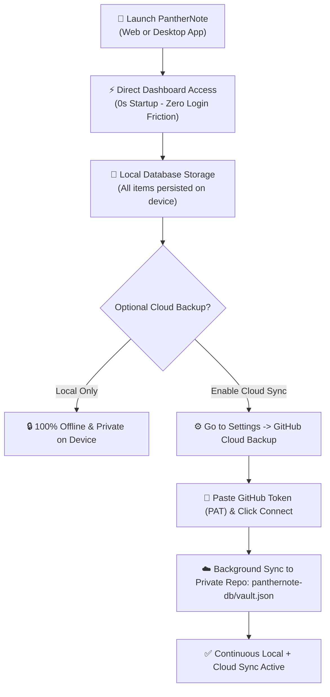

<div align="center">

  <!-- Animated Typing SVG Header Banner -->
  <a href="https://sachinmandawi.github.io/panthernote/">
    
  </a>

  <p align="center">
    <strong>🗄️ Securely manage Logins, Debit Cards, Bank Accounts, Notes, and 2FA Authenticator codes in one unified local-first software and private GitHub sync.</strong>
  </p>

  <p align="center">
    <a href="https://sachinmandawi.github.io/panthernote/"></a>
    <a href="https://github.com/sachinmandawi/panthernote/releases/download/v1.0.0/PantherNote-Setup-1.0.0.exe"></a>
    <a href="https://github.com/sachinmandawi/panthernote/releases/download/v1.0.0/PantherNote-Portable.exe"></a>
  </p>

  <p align="center">
    <a href="https://github.com/sachinmandawi/panthernote/releases/latest"></a>
    <a href="https://github.com/sachinmandawi/panthernote/stargazers"></a>
    <a href="https://github.com/sachinmandawi/panthernote/blob/main/LICENSE"></a>
  </p>

  <p align="center">
    <a href="#-about-panthernote"><strong>About</strong></a> •
    <a href="#-key-features"><strong>Features</strong></a> •
    <a href="#-how-it-works"><strong>Architecture</strong></a> •
    <a href="#-tech-stack"><strong>Tech Stack</strong></a> •
    <a href="#-quick-start--downloads"><strong>Downloads</strong></a> •
    <a href="#-license"><strong>License</strong></a>
  </p>

</div>

---

> [!IMPORTANT]
> 🛡️ **Local-First Privacy Guarantee**: PantherNote is 100% offline-ready and local-first by default. All vault records are saved directly onto your device's local database. Cloud backup is completely optional via your own private GitHub repository (<code>panthernote-db</code>).

---

## 📖 About PantherNote

**PantherNote** is a modern, privacy-first digital vault and password manager built for individuals who value speed, simplicity, and complete ownership of their data.

Traditional cloud password managers force users through tedious login barriers, master password friction, and reliance on centralized third-party servers. **PantherNote reimagines the experience from the ground up:**

- **⚡ Instant 0-Second Dashboard Launch**: Open the app and immediately view, search, and copy your passwords, cards, and 2FA codes with zero authentication screens or loading delays.
- **💾 Local-First Device Storage**: All items are automatically persisted on your local device. Work completely offline anytime, anywhere.
- **☁️ Frictionless Private Cloud Backup**: Connect your private GitHub repository (<code>panthernote-db</code>) anytime by simply pasting a Personal Access Token (PAT) in Settings. Zero browser cookie conflicts or OAuth redirect loops.
- **🔑 Built-in 2FA Authenticator**: Replace standalone authenticator apps with an integrated live RFC 6238 TOTP generator featuring 30-second countdown ring timers.
- **💳 3D Interactive Card Vault**: Manage debit and credit cards with realistic interactive 3D flip previews, CVV masking, and 1-tap copy tools.

---

## ✨ Key Features

<table>
  <tr>
    <td width="50%">
      <h3>⚡ Instant Direct Dashboard</h3>
      <p>Launches straight into your vault in 0 seconds. No login screens, master password prompts, or session timeouts.</p>
    </td>
    <td width="50%">
      <h3>💾 Local-First Persistence</h3>
      <p>All passwords, credit cards, bank accounts, and secure notes are stored directly and securely on your local device.</p>
    </td>
  </tr>
  <tr>
    <td width="50%">
      <h3>☁️ Optional GitHub Cloud Sync</h3>
      <p>Backup and sync vault records directly to your private GitHub repository (<code>panthernote-db</code>) via Settings PAT token.</p>
    </td>
    <td width="50%">
      <h3>🔑 Built-in 2FA Authenticator</h3>
      <p>Integrated RFC 6238 TOTP generator with 30-second live countdown rings. Offline calculation with zero external server dependency.</p>
    </td>
  </tr>
  <tr>
    <td width="50%">
      <h3>🛡️ Security & Health Audit</h3>
      <p>Proactive scanner detects weak, reused, or stale (90+ day old) passwords with instant health score feedback.</p>
    </td>
    <td width="50%">
      <h3>🎨 Smart Brand Auto-Detection</h3>
      <p>Instant brand recognition for 100+ popular services, credit cards, and banks (Google, GitHub, Supabase, HDFC, SBI, PayPal).</p>
    </td>
  </tr>
  <tr>
    <td width="50%">
      <h3>⚡ 1-Tap Copy & Drag Auto-Scroll</h3>
      <p>Instant 1-tap copy for usernames, passwords, and card numbers. Dynamic 60fps auto-scrolling when dragging cards near viewport edges.</p>
    </td>
    <td width="50%">
      <h3>⚠️ 3-Option Granular Danger Zone</h3>
      <p>Granular purge options: <strong>Delete Local Only</strong>, <strong>Delete GitHub Backup Only</strong>, or <strong>Full Purge (Both)</strong> with <code>DELETE</code> confirmation protection.</p>
    </td>
  </tr>
</table>

---

## 🏗️ How It Works



---

## 💻 Tech Stack

<div align="center">

| Component | Technology | Description |
| :--- | :--- | :--- |
| **Frontend Core** | `HTML5` / `Vanilla JavaScript (ES2024)` | High-performance Single Page Application with 0 framework overhead |
| **Styling Engine** | `Vanilla CSS3` | Dark Glassmorphic Design System with fluid micro-animations |
| **2FA Cryptography** | `Web Crypto API (SubtleCrypto)` | Native browser-based `HMAC-SHA1` RFC 6238 TOTP Engine |
| **Desktop Application** | `Electron` & `electron-builder` | Standalone Windows NSIS Setup & Portable Executables |
| **Vault Storage** | `Local Storage` & `GitHub REST API v3` | Local-first storage with optional private repository backup |
| **Icon System** | `FontAwesome 6 Free` | Scalable vector UI icons & brand palettes |

</div>

---

## 🚀 Quick Start & Downloads

### 📱 Windows Desktop App (.exe)
Download the latest pre-compiled binaries from the **[Releases Page](https://github.com/sachinmandawi/panthernote/releases/latest)**:

| File | Type | Description | Download |
| :--- | :--- | :--- | :--- |
| **`PantherNote-Setup-1.0.0.exe`** | **Windows Installer** | Standard Windows NSIS Setup with Start Menu & Desktop shortcuts | [📥 Download Setup](https://github.com/sachinmandawi/panthernote/releases/download/v1.0.0/PantherNote-Setup-1.0.0.exe) |
| **`PantherNote-Portable.exe`** | **Portable Standalone** | No installation required. Double click to run directly anywhere | [⚡ Download Portable](https://github.com/sachinmandawi/panthernote/releases/download/v1.0.0/PantherNote-Portable.exe) |

---

### 🌐 Web App (Local Development)
```bash
# 1. Clone the repository
git clone https://github.com/sachinmandawi/panthernote.git
cd panthernote

# 2. Start local server
npx -y serve -l 8000 .
# Open http://localhost:8000 in your browser
```

---

## 📜 License

Distributed under the **MIT License**. See [`LICENSE`](LICENSE) for more details.

<div align="center">
  <br />
  <sub>Crafted with ❤️ for total privacy, productivity, and simplicity. Powered by PantherNote.</sub>
</div>
